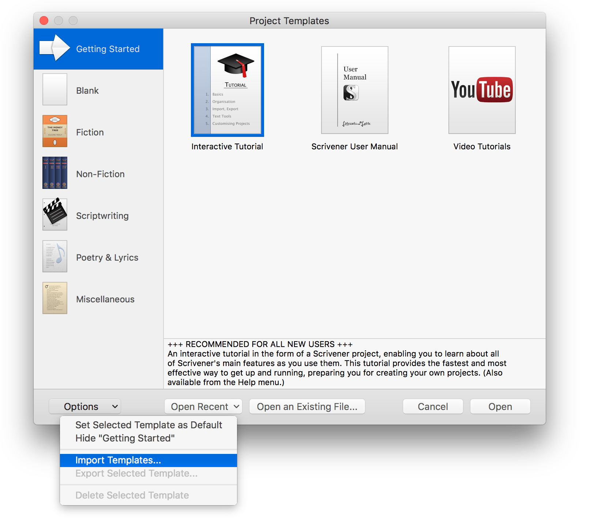

# Templates for Scrivener 3

## Available templates:
- [__APA (7th Ed)__](https://github.com/jgarr16/Scrivener/raw/master/downloads/APA.zip) - Conforms to the most recent release of the American Psychological Association's Style Guide.

## Importing a template into Scrivener: 
1. Download your template of choice _(it's pretty easy when there's only one!)_.
2. Unzip the file, if necessary.
3. Open the Scrivener application.
4. Select the __Import Templates...__ option from the __Options__ menu in the lower, left corner of the Scrivener splash page.

5. Locate and select the template file (_the file will have a __.scrivtemplate__ file type_).
6. Choose the category that best fits your template.
7. Enjoy!
